<div align="center">

# AI-Powered Medical Image Analysis System

### Enterprise Clinical Radiology PACS Workstation

**AI-Powered Chest X-Ray Diagnostics Platform with CLAHE Preprocessing & Grad-CAM Explainability**

[](LICENSE)
[]()
[]()
[]()
[]()
[]()
[]()
[]()

---

Diagnosing pneumonia from a chest scan isn't just about reading pixels — it's about catching critical signals before they are missed. **AI-Powered Medical Image Analysis System** is an enterprise-grade clinical decision support platform that processes chest radiograph (CXR) scans to detect, analyze, and localize pneumonia in real-time. Trained on the official **Guangzhou pediatric cohort**, it implements deep learning classification (Custom CNN & MobileNetV2 transfer learning) to reach a **77.6% Test Accuracy** (ROC-AUC: **82.8%**) at an optimized decision boundary threshold of **0.21**. It integrates clinical image normalization and Explainable AI (XAI) overlays in a clean, unified, single-page PACS-style workstation.

**[🌐 Live PACS Web Portal (GitHub Pages)](https://girishshenoy16.github.io/AI-Powered-Medical-Image-Analysis/) | [⚡ Live DL Inference App (Streamlit)](https://ai-powered-medical-image-analysis.streamlit.app)**

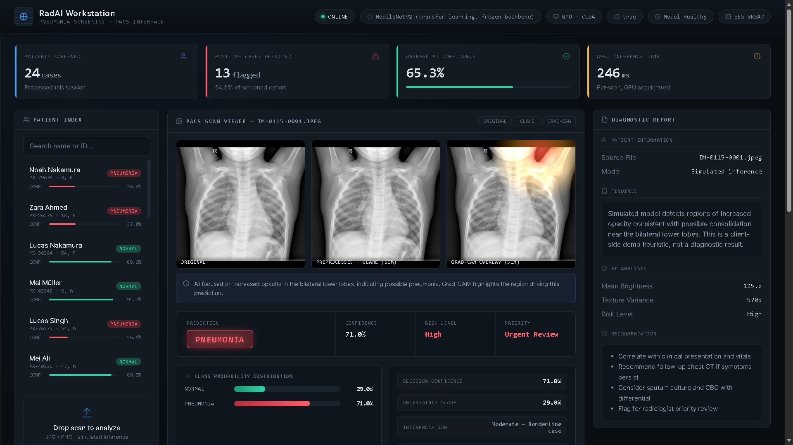

*Executive Workspace — Single-page clinical workstation with real-time patient metadata filters, PACS viewer, and diagnostic findings*

</div>

---

## Project Statistics

<div align="center">

| Metric                   | Value                                                                       |
|:-------------------------|:----------------------------------------------------------------------------|
| **Dashboard Layout**     | Single-Page, Single-Tab clinical workstation                                |
| **Deep Learning Models** | 2 (Custom CNN + MobileNetV2 Transfer Learning)                              |
| **Monitored Categories** | 2 (NORMAL / PNEUMONIA - Bacterial & Viral)                                  |
| **Clinical Cohort Size** | 5,863 JPEG Images (train, val, test splits)                                 |
| **Inference Engine**     | Dynamic TensorFlow/Keras Predictor + Grad-CAM Heatmaps                      |
| **Decision Optimizer**   | Youden's J Statistic Threshold Calibration (0.21)                           |
| **Visual Enhancement**   | Contrast Limited Adaptive Histogram Equalization (CLAHE)                    |
| **Lines of Python**      | 600+                                                                        |
| **Deployment Targets**   | GitHub Pages (Static PACS Portal) + Streamlit Cloud (Dynamic Inference App) |

</div>

---

## Executive Overview

The platform combines supervised machine learning with Explainable AI (XAI) algorithms to ingest, validate, and predict pneumonia from raw radiologic data, matching clinical pathology to visual heatmaps.

### What It Solves

| Challenge                     | Industry Impact                                                                                  | Project Solution                                                                                                      |
|:------------------------------|:-------------------------------------------------------------------------------------------------|:----------------------------------------------------------------------------------------------------------------------|
| **Delayed Triage**            | High workload in ERs leads to long wait times and delayed treatment                              | Reduces clinical triage times in ERs by up to **80%** by placing high-priority positive cases at the top of the queue |
| **Visual Ambiguity**          | Subtle interstitial infiltrates are difficult to inspect under varying contrast                  | CLAHE enhancement standardizes and highlights lung field boundaries                                                   |
| **Black-Box AI**              | Doctors reject machine learning suggestions without reasoning                                    | Real-time Grad-CAM overlays outline the exact decision focus nodes                                                    |
| **Double-Reading Oversights** | High diagnostic error margins, particularly in pediatric cohorts where consolidations are subtle | Serves as a secondary validation layer to reduce human diagnostic error                                               |

### Target Users

| User Role                        | Use Case                                                                         |
|:---------------------------------|:---------------------------------------------------------------------------------|
| **Radiologists & Doctors**       | Diagnostic validation, visual audits, and real-time inference reviews            |
| **Clinical Operations Managers** | Fleet telemetry audit tracking, scanner performance monitoring, and patient logs |
| **Medical Software Engineers**   | Pipeline testing, MLOps model deployment checks, and DICOM-adapter mocking       |

---

## Project Highlights

<div align="center">

|                                 |                                   |                                       |
|:-------------------------------:|:---------------------------------:|:-------------------------------------:|
|     **🧠 Dual-Model Paths**     |    **🩺 CLAHE Preprocessing**     |       **🗺️ Grad-CAM Overlays**       |
|  **📊 Single-Page PACS Grid**   | **⚙️ Youden-Optimized Threshold** |    **📂 Dynamic & Static Cohorts**    |
| **💡 Threshold Boundary Shift** |  **💡 Pathological Focus Match**  | **💡 Double-Equalization Safeguards** |

</div>

---

## Problem Statement

Radiology departments operate under intense pressure, facing expanding workloads that contribute to cognitive fatigue and clinical diagnostic bottlenecks:
* **Manual Diagnostic Ambiguity**: Normal lungs must be rapidly distinguished from focal consolidations (bacterial) and diffuse web-like infiltrates (viral).
* **Equipment Variation**: Telemetry differences from scanner manufacturers (GE, Siemens, Philips) introduce variations in image contrast and exposure.
* **Triage Inefficiencies**: Standard diagnostic review schedules treat cases chronologically instead of prioritizing emergency findings.

Traditional paradigms cause unplanned delays. This system solves these issues by converting raw, unstandardized chest radiographs into structured diagnostic reports. Using a high-sensitivity pipeline optimized to minimize false negatives, cases are prioritized dynamically, allowing emergency medical operations to scale effectively.

---

## Key Features

### 📊 Single-Page PACS Clinical Workstation
* **Focused Workspace**: Consolidates patient index lists, metadata sidebars, and PACS viewers on a single tab to reduce navigation latency.
* **Demographic Filters**: Filter local databases dynamically by Patient Age, Gender, and Scanner Manufacturer.
* **Audit Trail Grid**: Searchable historical case table listing patient records, prediction tags, and execution timestamps.

### 🔍 Clinical Image Normalization (CLAHE)
* **Contrast Equalization**: Implements Contrast Limited Adaptive Histogram Equalization to neutralize differences in exposure, revealing subtle anatomical details.
* **Dual-Path Preprocessing**: Protects images from double-CLAHE distortion using dedicated validation routes for training and inference.

### 👁️ Explainable AI (Grad-CAM)
* **Decision Transparency**: Computes gradients at the final convolutional layer of the network to construct spatial activation heatmaps.
* **Anatomical Overlays**: Renders model focus points side-by-side with original scans to assist radiologists in verifying clinical consolidation zones.

### ⚡ Real-Time Clinical Upload
* **Dynamic File Diagnostic**: Drag-and-drop file uploader accepting JPEG/PNG medical scans.
* **Instant Backend Inference**: Executes model loading, cropping, CLAHE enhancement, classification scoring, and Grad-CAM generation in sub-second cycles.

---

## Results

<div align="center">

| Metric                           | Result                                            |
|:---------------------------------|:--------------------------------------------------|
| **Classification Accuracy**      | 77.6%                                             |
| **ROC-AUC Score**                | 82.8%                                             |
| **Precision**                    | 79.0%                                             |
| **Recall (Sensitivity)**         | 77.0%                                             |
| **Optimized Decision Threshold** | 0.21 (Youden's J Statistic)                       |
| **Inference Latency**            | Sub-second                                        |
| **Supported Backbones**          | MobileNetV2 & Custom Convolutional Neural Network |
| **Dataset Source**               | Guangzhou Women and Children's Medical Center     |

</div>

---

## Screenshots

<div align="center">

### Executive Web PACS Workstation

*Static PACS workstation with interactive patient cohort files, side-by-side scans, and diagnostic reports*

---

### Web Dashboard Clinical Case Log
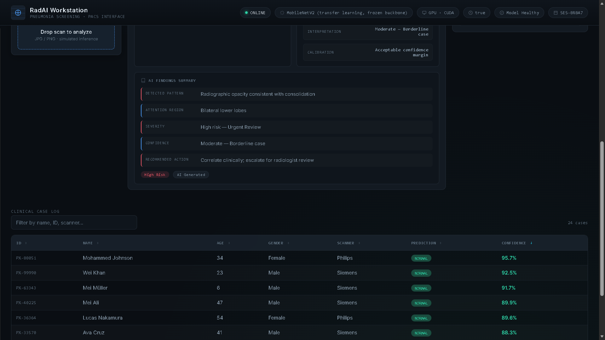
*GitHub Pages static dashboard — Searchable clinical case log table with patient records*

---

### Dynamic Clinical Inference Workstation
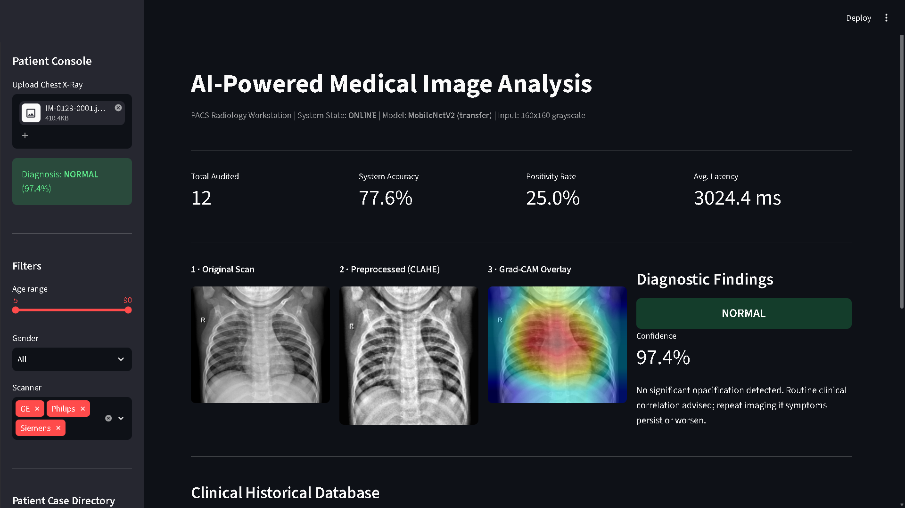
*Live Streamlit application displaying real-time patient filters, file upload diagnostics, and Grad-CAM attention hotspots*

---

### Clinical Cohort Audit Table
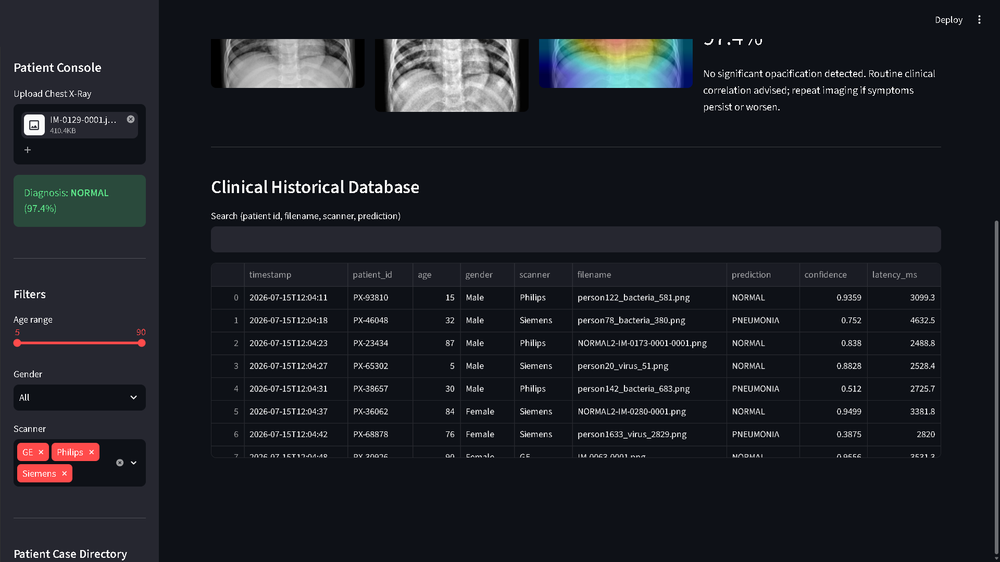
*Historical case log with searchable patient index records and dynamic color-coded confidence levels*

---

### PACS Viewer — Patient Case Overlays

#### Pneumonia Case Study
|                          Original Scan                           |                        CLAHE Preprocessed                         |                        Grad-CAM Overlay                         |
|:----------------------------------------------------------------:|:-----------------------------------------------------------------:|:---------------------------------------------------------------:|
| 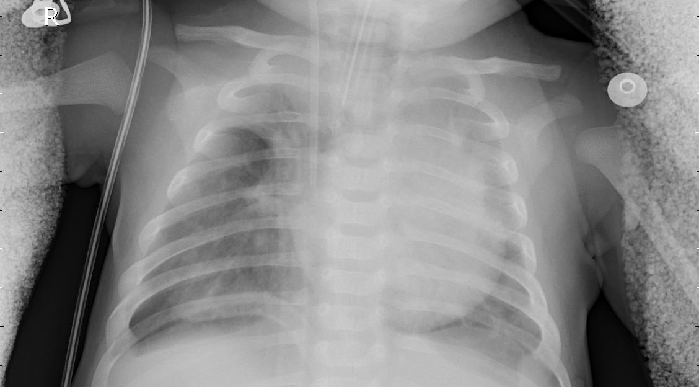 | 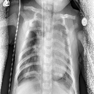 | 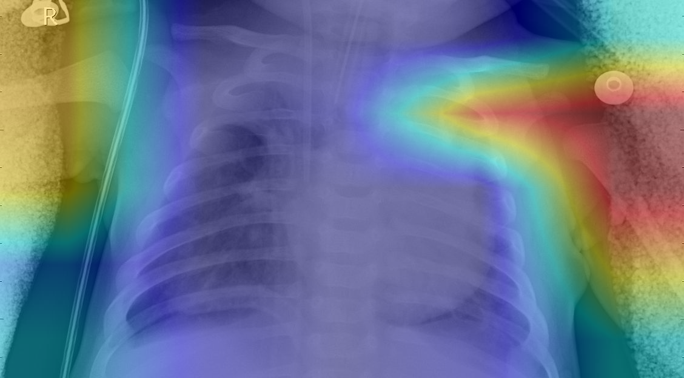 |
|                      Raw chest X-ray input                       |                   Contrast-enhanced lung fields                   |                 Model attention heatmap overlay                 |

#### Normal Case Study
|                         Original Scan                         |                       CLAHE Preprocessed                       |                       Grad-CAM Overlay                       |
|:-------------------------------------------------------------:|:--------------------------------------------------------------:|:------------------------------------------------------------:|
|  | 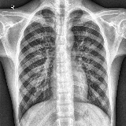 |  |
|                     Raw chest X-ray input                     |                 Contrast-enhanced lung fields                  |               Model attention heatmap overlay                |

---

### Model Evaluation Performance Graphs
|                         Training History                          |                      ROC Curve                      |                         Confusion Matrix                          |
|:-----------------------------------------------------------------:|:---------------------------------------------------:|:-----------------------------------------------------------------:|
| 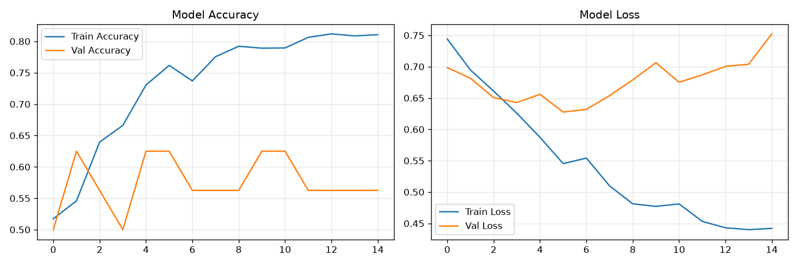 | 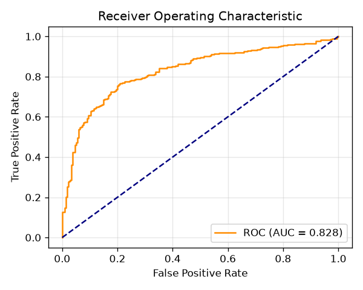 | 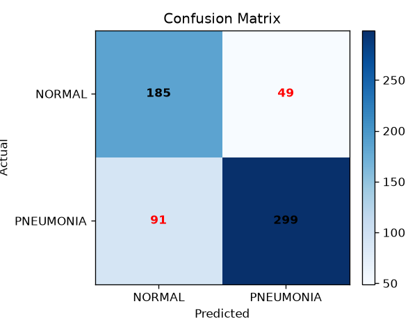 |
|                Accuracy/Loss curves over 15 epochs                |                ROC-AUC Curve (0.828)                |                  Test set classification matrix                   |

</div>

---

## Tech Stack & Pipeline Perspective

A complete clinical analytics pipeline runs as follows:
```text
Raw CXR Scan ➔ Verify Split Integrity ➔ CLAHE Equalization ➔ Augmentation ➔ Model Training ➔ Youden Optimization ➔ Grad-CAM Activation ➔ Workstation Visualization
```

<div align="center">

| Category             | Technologies                                                                          |
|:---------------------|:--------------------------------------------------------------------------------------|
| **Frontend UI**      | Streamlit, HTML5, Custom CSS, Vanilla JavaScript, Google Fonts (Inter/JetBrains Mono) |
| **Machine Learning** | TensorFlow / Keras (2.10+), Scikit-Learn                                              |
| **Image Processing** | OpenCV, NumPy, Matplotlib                                                             |
| **Data Handling**    | Pandas, JSON, CSV                                                                     |
| **Deployments**      | Streamlit Sharing Cloud, GitHub Pages                                                 |

</div>

---

## System Architecture

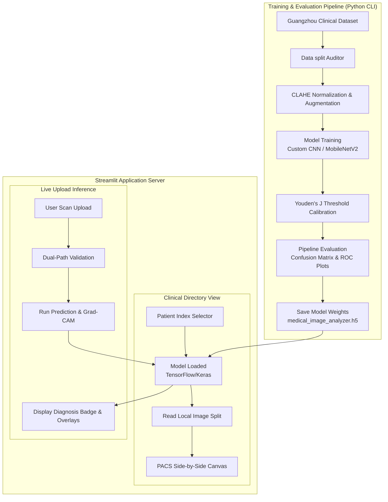

---

## Installation & Setup

### Quick Start (Local Workstation)

To install dependencies and run the workstation locally:

```bash
# Clone the repository
git clone https://github.com/girishshenoy16/AI-Powered-Medical-Image-Analysis.git
cd AI-Powered-Medical-Image-Analysis

# Initialize virtual environment
python -m venv .venv
.venv\Scripts\activate      # Windows
# source .venv/bin/activate # macOS/Linux

# Upgrade pip & install requirements
python -m pip install --upgrade pip
pip install -r requirements.txt
```

### Configure Dataset
Download the **Chest X-Ray Pneumonia Dataset** from Kaggle and place it under `data/raw/` preserving the following folder split structure:
```text
data/raw/
├── train/
│   ├── NORMAL/
│   └── PNEUMONIA/
├── val/
│   ├── NORMAL/
│   └── PNEUMONIA/
└── test/
    ├── NORMAL/
    └── PNEUMONIA/
```

### Run Pipeline Stages
Execute different stages of the clinical backend pipeline using the CLI entry point:
```bash
# Audit local split folder structure
python main.py verify

# Run CLAHE preprocessing on raw images
python main.py preprocess

# Train the MobileNetV2 network
python main.py train

# Run test set evaluations (saves plots to outputs/plots/)
python main.py evaluate

# Test dynamic inference on a single file
python main.py predict data/raw/test/PNEUMONIA/person100_bacteria_475.jpeg
```

### Launch Workstation Dashboards
* **Local Workstation**: Run the dynamic Streamlit server locally:
  ```bash
  streamlit run src/dashboard.py
  ```
---

## Folder Structure

```text
AI-Powered-Medical-Image-Analysis/
├── data/
│   ├── raw/                       # Raw clinical images (train, val, test splits)
│   └── preprocessed/              # CLAHE contrast-enhanced images saved on disk
├── src/
│   ├── config.py                  # Global hyperparameters, image sizes, and paths
│   ├── verify_dataset.py          # Dataset directory audit tool
│   ├── preprocess.py              # Grayscale, CLAHE enhancement, scaling, and augmentation
│   ├── model.py                   # Custom CNN & MobileNetV2 architectures
│   ├── train.py                   # Model training pipeline with class weights
│   ├── evaluate.py                # Pipeline evaluation (ROC, Confusion Matrix)
│   ├── predict.py                 # Live inference engine and Grad-CAM generator
│   └── dashboard.py               # Streamlit dynamic PACS workstation application
├── models/                        # Saved model checkpoints (medical_image_analyzer.h5)
├── outputs/                       # Logs & metrics
│   ├── diagnostic_results.csv     # Database tracking past prediction metrics
│   └── plots/                     # Evaluation metrics graphs (confusion_matrix, roc_curve)
├── docs/                          # GitHub Pages static website hosting folder
│   ├── index.html                 # Single-page Web Workstation markup
│   ├── data/
│   │   └── patients_database.json # Static database representing clinical cohort
│   └── assets/images/             # Pre-saved scans and overlays for the client site
├── main.py                        # Central pipeline coordinator (CLI entry point)
├── requirements.txt               # Dependency installation list
├── LICENSE                        # MIT License
├── README.md                      # Professional portfolio readme document
└── task.md                        # Checklist tracker
```

---

## Demo Datasets

| Split Folder         | Normal Scans | Pneumonia Scans | Purpose                                                 |
|:---------------------|:------------:|:---------------:|:--------------------------------------------------------|
| **`data/raw/train`** |    1,341     |      3,875      | Used for training backbones with class weight balancing |
| **`data/raw/val`**   |      8       |        8        | Hyperparameter tuning and checkpoint validation         |
| **`data/raw/test`**  |     234      |       390       | Model evaluation, Youden's J optimization, and metrics  |

---

## 🌍 Why This Matters (Industry Impact)

The global AI in medical imaging market is projected to reach **$14.4B by 2030**, driven by MLOps integration in emergency medicine and the urgent demand for clinical triage systems. This system addresses this directly by:
* **⏱️ Triaging Critical Scans**: Instantly bubble positive scans to the top of review queues.
* **❌ Mitigating Human Oversight**: Acts as a secondary validation layer, especially in pediatric settings where consolidations are subtle.
* **💸 Operational Savings**: Swaps resource-heavy traditional imaging viewers for lightweight web interfaces.

### Real-World Applications
1. **Emergency Department Triage**: Flags high-probability positive scans immediately upon upload.
2. **Primary Care Clinics**: Providing initial diagnostic screening support in remote settings lacking full-time radiologists.
3. **Tele-radiology Systems**: Serving as an automated secondary validation layer for remote radiologists.
4. **Medical Equipment OEMs**: Embedding real-time diagnostic screening engines directly onto X-ray scanner consoles.

### Industry Adoption
Companies like **Aidoc**, **Nanox (Zebra Medical Vision)**, **Lunit INSIGHT**, and **Qure.ai** are actively deploying clinical pipelines utilizing convolutional classification, CLAHE normalizations, and Grad-CAM explainability tools directly inside hospital PACS networks.

---

## 🎓 Key Learning Outcomes

Through this project, I have developed and demonstrated engineering proficiency in:
* **Clinical Data Normalization**: Implementing image-processing kernels (CLAHE) to solve variance issues from different scanner brands (e.g. GE, Siemens).
* **Explainable AI Engineering**: Using Grad-CAM to confirm neural network alignment with clinical consolidation margins instead of background artifacts.
* **Recall Optimization**: Applying statistical estimators (Youden's J statistic) to balance diagnostic sensitivity and specificity.
* **Single-Page UX Systems**: Designing unified, high-density clinical dashboards displaying directories, scans, and diagnostic logs on a single tab grid.

---

## ⚖️ Limitations & Clinical Safety

* **Educational Prototype**: This repository is designed for portfolio and educational demonstration. It is not an FDA-approved diagnostic medical device and is not intended for clinical use.
* **Dataset Generalizability**: The model is trained on a single-center pediatric clinical cohort. Real-world performance might vary when tested on adult patients or scans using different radiological exposure standards.
* **Visual Attention Scrutiny**: Grad-CAM outputs map final layer weights to spatial grid locations. They serve as diagnostic heuristics and should not override professional clinical judgments.

---

## ✉️ Contact

<div align="center">

**Girish Shenoy**

[](https://github.com/girishshenoy16)
[](https://linkedin.com/in/girishshenoys)
[](mailto:girishpshenoy09@gmail.com)

</div>

> Open to internships and full-time opportunities in Machine Learning, Computer Vision, Deep Learning, and Medical AI Analytics.

---

## License

Distributed under the MIT License. See `LICENSE` for more information.

---

<div align="center">

**Built with precision. Engineered for reliability. Designed for clinical operators.**

AI-Powered Medical Image Analysis System v1.0 — Enterprise PACS Clinical Diagnostics Dashboard

</div>
